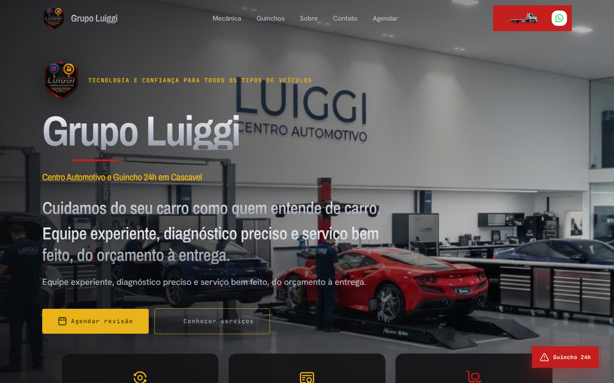

# Landing Pages

Índice público de landing pages em produção.

Este repositório é uma **capa de portfólio**: documenta o que foi entregue, a stack e os sites ao vivo. O código de cada projeto fica em repositórios **privados** (clientes / NDA).

## Resumo

| Projeto | Stack | Status | Site |
|---------|-------|--------|------|
| Luiggi Auto | Next.js 15, TypeScript, Tailwind, PostgreSQL, Docker | Produção | [luiggiauto.com.br](https://www.luiggiauto.com.br) |
| Decod Sistemas | HTML5, CSS3, JavaScript (sem framework) | Produção | [decodsistemas.com.br](https://decodsistemas.com.br) |

## Cases

### Luiggi Auto

Landing page administrável para o Grupo Luiggi (centro automotivo e guinchos), com painel para edição de conteúdo em produção.

- **Stack:** Next.js 15, React 19, TypeScript, Tailwind CSS, PostgreSQL, CKEditor, GSAP, Docker / Traefik
- **Entrega:** landing + CMS admin, SEO (sitemap/robots), upload de mídia, preview ao vivo, deploy em VPS
- **Destaques técnicos:** autenticação de admin, headers de segurança e CSP, sanitização de HTML, otimização de imagens
- **Repositório:** `lMazer/lp-luiggiauto.com.br` *(privado)*
- **Site:** [https://www.luiggiauto.com.br](https://www.luiggiauto.com.br)

### Decod Sistemas

Site institucional multi-página para apresentar a empresa, o produto iCode+, serviços e canais de contato comercial.

- **Stack:** HTML5, CSS3, JavaScript puro, assets locais (sem build / sem framework)
- **Entrega:** home, produtos, serviços e contato, com CTA via WhatsApp
- **Destaques técnicos:** implementação fiel ao Figma, zero dependências externas de JS, base leve e fácil de manter
- **Repositório:** `lMazer/lp-decodsistemas.com.br` *(privado)*
- **Site:** [https://decodsistemas.com.br](https://decodsistemas.com.br)

## Padrões que sigo

- Layout responsivo (mobile → desktop)
- SEO básico (títulos, meta, sitemap/robots quando aplicável)
- Performance de assets (imagens otimizadas, peso consciente)
- Acessibilidade mínima (semântica HTML, contraste, navegação por teclado onde faz sentido)
- Documentação e caminho de deploy claros em cada projeto

## Como adicionar um novo projeto

Siga o template em [docs/ADDING_A_PROJECT.md](docs/ADDING_A_PROJECT.md).
